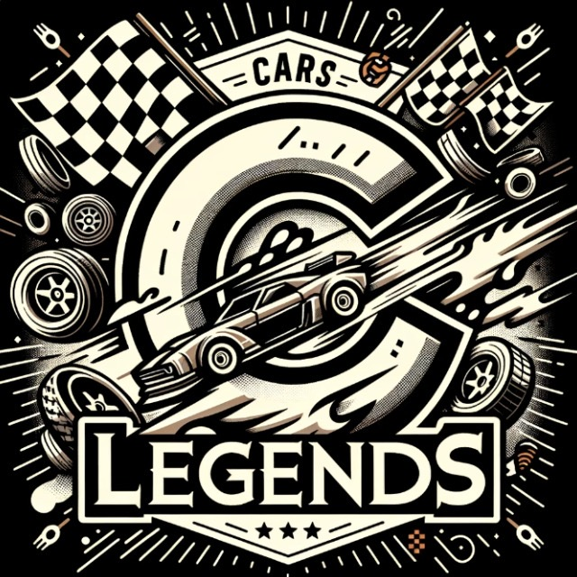

# CarsLegends

Juego de conduccion playground con obstaculos y competicion en modo cooperativo.

## Tabla de Contenidos

- [Caracteristicas](#caracteristicas)
- [Capturas de Pantalla](#capturas-de-pantalla)
- [Video del Juego](#video-del-juego)
- [Instalacion](#instalacion)
- [Requisitos del Sistema](#requisitos-del-sistema)
- [Controles](#controles)
- [Creditos](#croditos)

## Documentacion Oficial

- [Solid Objects Physics](https://uab-my.sharepoint.com/:w:/g/personal/1636620_uab_cat/EZCgwnlm3thHhgb-iBtkmAYBrFd_dM_bNbFYWukjJxeDNw?e=NM4Pq8)
- [Manual](https://uab-my.sharepoint.com/:w:/g/personal/1636620_uab_cat/Ed3Rbka1K9JNlB6b6gTrcbkBjVDjyUQ3TFh0K1qsNm_asQ?e=HseOAd)
- [Calendario](https://uab-my.sharepoint.com/:w:/g/personal/1636620_uab_cat/EbBrbAlbQ_1OpnWr8QHX4K0BqVsWpEeOUMkfbsMWstqcpg?e=8B3aCJ)
- [GDD](./DOCUMENTACION/DOCUMENTOS_PROPIOS/GDD_Inicial_Cars_Legends.pdf)
- [Actas](./DOCUMENTACION/ACTAS_DE_REUNION)

## Caracteristicas

El juego incorpora objetos cotidianos como obstaculos y un modo de juego cooperativo local donde se puede jugar a futbol con los coches. La ambientacion transcurre en una mesa de estudio donde se simula que un nioo esta tratando de aprender a conducir mientras juega.
 
  - Modo cooperativo local.
  - Estilo Low-Poly, Retro, Playground.
  - Control mediante GamePad.
  - Musica y efectos Retro (estilo 8-bit)
  - El unico objetivo es divertirse.
  - Referencias a la cultura popular.
  - SI DUDAS, ACELERA!

## Capturas de Pantalla

## Video del Juego - Referencias

[MicroMachines](https://www.youtube.com/watch?v=tWws3X9EVhA)

## Instalacion

## Autores

- **Joel Marco Quiroga Poma** - 1504249
- **Adrian Gonzalez Ortega** - 1636620
- **Carlos A. Melis Curbelo** - 1605420
- **Gabriel Juan Betes** - 1562750
- **Xavier Burgos Flores** - 1568871

